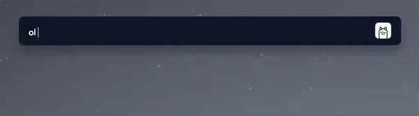

# Flow Launcher Plugin - Ollama
This Flow Launcher Plugin allows you to interact with a local Ollama instance and your favorite and private LLMs (e.g. Llama 3, Gemma 3, Phi-4, DeepSeek-R1, TinyLlama, ...). It provides a convenient way to access the power of these language models directly from Flow Launcher.
The plugin offers two interaction options, copying the answer directly to the clipboard and writing the conversation (question + response) to a text file, which can be opened directly via the plugin.



## Prerequisites
The Ollama plugin requires Python 3.9 or later. Official support for Python 3.8 ended with release v1.1.2. The plugin has been tested and verified with Python versions between 3.9 and 3.13.

To interact with a local LLM (Large Language Model) and use this plugin, an Ollama instance (server) must be running. There are two different installation variants here, which you can also select depending on the underlying OS:
1. Installation via Docker (OS independent)
    - Go to [Install Docker Engine](https://docs.docker.com/engine/install/) and follow the installation instructions
    - Pull the [Ollama Image](https://hub.docker.com/r/ollama/ollama) and start the Container
    - Optional: If the container and the Large Language Model are to be operated using a graphics card, follow the next steps
        - Download and installation of the [NVIDIA CUDA Toolkit](https://developer.nvidia.com/cuda-downloads)
        - Download and Installation of the [NVIDIA Container Toolkit](https://docs.nvidia.com/datacenter/cloud-native/container-toolkit/latest/install-guide.html)
        - Here is an example of a Docker-Compose that you can use to deploy Ollama with an NVIDIA graphics card:
            ```yaml
            ---
            services:
            ollama:
                image: ollama/ollama:latest
                container_name: ollama
                ports:
                  - "11434:11434"
                restart: always
                volumes:
                  - $HOME/.ollama:/root/.ollama
                deploy:
                resources:
                    reservations:
                    devices:
                        - driver: nvidia
                        count: 1
                        capabilities: [gpu]
            ```
2. Direct installation OS
    - Go to [Ollama Download](https://ollama.com/download) and select your operating system
    - Follow the installation instructions and then ensure that the instance is running

## Installation
1. Download and install [Flow Launcher](https://www.flowlauncher.com/).
2. Open the Flow Launcher settings
3. Go to the **Plugin Store** tab
4. Search for **'Ollama'**
5. Click and Install **Ollama**
6. Flow Launcher should restart automatically. If not, restart Flow Launcher manually
7. Re-open the Flow Launcher settings and head to the **Plugins** tab
8. Customize the [Settings](#settings) according to your configuration
9. Run the **'Save Settings'** command in Flow Launcher

## Settings
|Setting|Default|Description|
|---|---|---|
|Action keyword|ol|Keyword to activate the plugin.|
|Ollama Host|http://localhost:11434|URL of the local Ollama instance to communicate via API.|
|Ollama Model|llama3.2:1b|The LLM to be used ([Ollama model library](https://ollama.com/library)).|
|Automatic Model Download|[ ] - *false*|Download LLM automatically if not already installed.<br>*Be careful - the download may take some time and storage on your disk*.|
|Save Chat to File|[x] - *true*|Should the chat be saved as a text file? This allows it to be opened directly in a text editor.|
|Enable CoT (Chain-of-Thought)|[x] - *true*|Enable or disable the Chain-of-Thought reasoning for supported models (e.g. DeepSeek-R1).<br>Disabling this option will remove the \<think> tag and suppress intermediate reasoning steps.|
|Chat preview preserve newline|[ ] - *false*|Should the chat preview retain the line breaks or output them as continuous text.<br>If true, the heading 'Copy Response to Clipboard' can be moved outside the visible area. However the text is still always copied to the clipboard with the correct formatting. [View an example](#example)|
|Chat preview length|100|Length of the chat preview, freely selectable. [View an example](#example)|
|Prompt Stop|&#124;&#124;|Characters to indicate end of prompt. This saves computing time, as otherwise the LLM is executed every time a key is pressed.|
|Log Level|ERROR|The Log Level can be adjusted for error analysis. Normally not of interest for users.|

## Example

*Flow Launcher Preview without preserved line breaks*


*Flow Launcher Preview with preserved line breaks*
